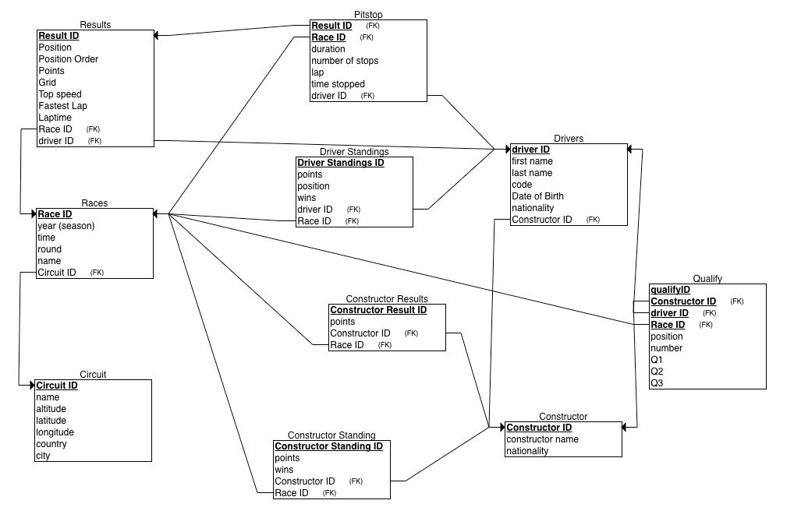
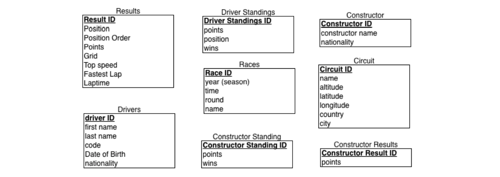
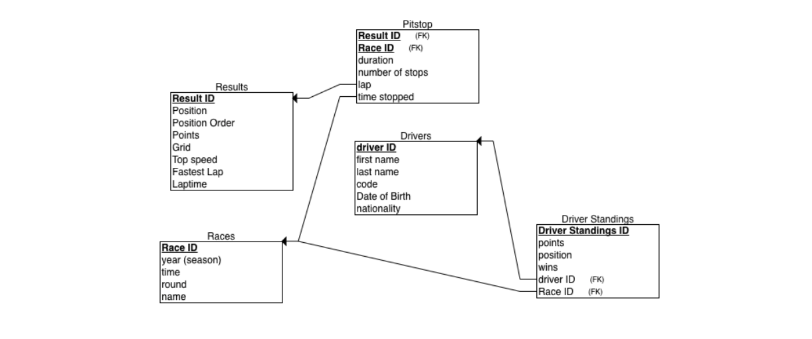
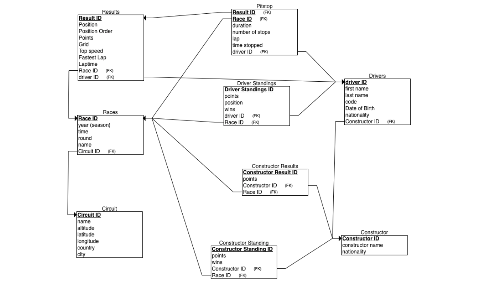
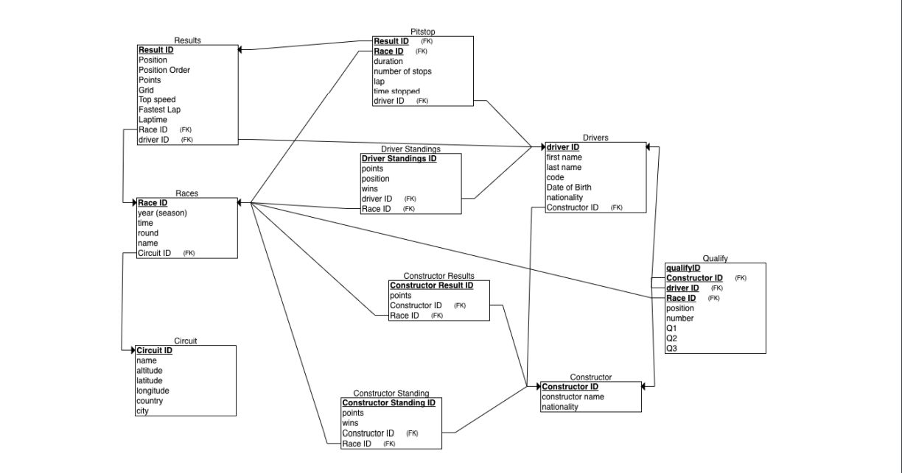

# Ergast F1 Dataset 
February 28, 2023 

University of Manitoba 

COMP 3380 A01 Group 27  

Professor: Anifat Olawoyin 

Data from: [Ergast](http://ergast.com/mrd/db/)

## Contributers
- [Martin Popper](https://github.com/martinpopper)
- [Owen Ostermann](https://github.com/oostermann10)
- [Christian Trites](https://github.com/ChristianTrites)
- [Filip Karamanov](https://github.com/FilipKaramanov)

Includes: 
- Description
- ER Model
- Relational Schema 

The ErgastF1 database provides information on Formula 1 Racing starting from the 1950s to present. Formula one is the highest class of international racing for open wheel single seater cars. The name formula comes from the set of specific rules that the participating cars and drives must follow. The objective of a formula one contest is to determine the winner of a race, the driver who crosses the finish line first while completing the specific races number of laps is declared the winner.  

The ErgastF1 dataset contains a table called constructor. In formula 1 a constructor is known as the ‘team’. The dataset also contains a table called drivers. A constructor or team can have a maximum of four drivers per season. The teams have support staff who work at the teams pitstop during the race. The Constructor table contains the teams ID, the name and their nationality of the team. For example, the teams ID is a numerical value, the name of the team is usually the company or sponsorship, such as Ferrari, McLaren, or Honda, these companies are the ones who supply things like the engine and the build of the car. The Driver table contains the drives first and last name, the driver ID, the code, their nationality, and date of birth. For example, one of the most famous and popular F1 racers, Lewis Hamilton, would have his name stored, an assigned driver ID, his code HAM, his nationality, British, and his date of birth, 1985- 01-07.  

Races are hosted at what are known as circuits throughout the formula 1 season. A circuit can be thought of as the venue in which the race is to be held at. The circuit table in the database contains the name of the track, the country in which it is located, the city in which it takes place in, the exact latitude and longitude of the track, and the altitude. 

The formula 1 season has on average 17-22 races throughput the season. The format of the race takes an entire weekend. On Friday racers have the opportunity to have free practice sessions on the circuit. Saturday mornings they get more practice sessions and Saturday afternoon there is what is known as the qualifying rounds. Each of the 20 participating cars in that weekend get three knockout qualifying sessions for the main race. Q1 (qualifying 1) lasts 18 minutes, the bottom 5 cars with the slowest time are eliminated. These cars are then placed 20,19,18,17,16 on the grid. The grid is the placement that the car starts on the actual race day. Q2 begins after a brief interval with 16 cars and lasts 15 minutes. Again, the five slowest cars are eliminated and they occupy the places − 11, 12, 13, 14, 15, on the grid. Finally, Q3 begins with the 10 remaining cars and is 12 minutes long and fill the remaining 10 positions on the grid. The fastest driver occupies 'pole position', a position on the grid that is considered best to begin a game. The Qualifying table in the database encapsulates this information. It has the qualifying ID, race ID, constructor ID, driver ID, the number (number that the driver takes), the position they are in the grid, and their Q1, Q2, and Q3 times. If a car did not race in the Q2 or Q3, they just have a null value placed there in the qualifying table.  

Sunday, finally the race day. The main event of the grand prix is held on a Sunday             afternoon. The information on the race is stored in the races table in the database. The races     table stores information on the year the race took place, the race ID, the date, the circuit ID,      the round (round is just the race number during the season), and the date of the race. During a race there are pitstops that the drivers stop at, the pitstops are ran by the constructor in which the driver races for. The pitstop table is closely related to the race table as the pitstops are contained within races. The pitstop table contains information on the race ID, the driver ID who stops at that pitstop, the stop (meaning which stop it was out of the total stops during a certain race that the driver is taking part in), the time they stopped at the pitstop, and the duration of time in seconds that the driver stayed at the pitstop at.  

The present system of Formula One World Championship points scoring was adopted in 2010 and has been continuing since. Based on the system the top 10 drivers at the end of each Grand Prix will receive points based on the positions they finished and these points will contribute towards determining both, the World Drivers’ and World Constructors’ Championships at the end of the season. The winner receives 25 points (25 Drivers' Championship points as well as 25 Constructors' Championship points) and other drivers receive points according to the following table:  

|Place |Points |
| - | - |
|1 |25 |
|2 |18 |
|3 |15 |
|4 |12 |
|5 |10 |
|6 |8 |
|7 |6 |
|8 |4 |
|9 |2 |
|10 |1 |
The results table ties majority of the dataset together. It contains the result ID, position, position order, the points (points the driver received), laps, rank, fastest lap time, the driver ID, the race ID, the constructor ID, the grid, the rank, fastest lap speed, and the status ID. Further there is a constructor results table that contains the points that the constructor gets from their driver’s placings in the race. It contains the constructor result ID, the race ID, the constructor ID, and the amount of points form that race.  

Finally, the dataset contains information on the constructor standings and the driver standings throughout the seasons. Both contain the driver standings ID and the constructor standings ID respectively. The driver standings table contains the driver ID, the race ID, the points. Position, and wins. The constructor standings contain the race ID, points, constructor ID, position and wins. It may seem confusing but we have to remember that drivers race for constructors. Drivers compete against other drivers and get individual points, at the end of the season the driver with the most points wins. But drivers also race for constructors who get points based on the drivers positioning and ranking in the races, the constructors compete against each other through their drivers.  

Below we will describe constraints and assumptions of the database and provide the ER and Relational schema created for the ErgastF1 dataset.  

Firstly, lets observe and explain the ER diagram for the ErgastF1 database 

**Entities** 

1. Results  
1. Drivers  
1. Driver Standings 
1. Constructor Result  
1. Constructor 
1. Constructor Standings  
1. Races  
1. Circuits  
1. Pitstop (weak) 

Relationships  

1. Races **have** Results (1 to M) 
   1. One race in F1 has many results from different drivers. 
   1. Both are total participation as a race must have results and results must occur from a race in this case.  
1. Driver Standings **from** Races (1 to 1) 
   1. One driver gets a spot in the standings from a single race.  
   1. Both are partial participation as not all drivers race in every race and not all drivers make the standings.  
1. Races **occur at** Circuits (M to 1) 
   1. As there are many races throughout the season and weekend, many races can occur at a circuit, but a circuit can only be a single thing as it is the physical venue.  
   1. All races must occur at a circuit but not all circuits in the world have to host a race. 
1. Constructor Standings **from** Races (1 to M) 
   1. 1 constructor has a place in the standings that is determined over many races.  
   1. Both are optional participation as not all constructors need to participate in every race and not all races contain every constructor. 
1. Constructors **have** Constructor Standings (1 to 1) 
   1. One constructor has one place in the standings for the constructors.  
   1. Constructor result is total participation as all constructors in that race/season are somewhere in the results but not all constructors participate in every season, thus optional participation. 
1. Constructor Results **from** Races (1 to M) 
- There is one spot for each constructor in the results but the points are added and derived over many races.  
  1. Both are optional participation as not all constructors as not all constructors participate in every season and thus they are not going to be in those results for that season. 
7. Constructors **have** Constructor Results (1 to 1) 
   1. Every constructor is somewhere in the results but there is only one spot for each constructor in the results. 
   1. Constructor result is total participation as a constructor must be in the results but not all constructors are in the results as they don’t all participate in every season and race. 
7. Drivers **race for** Constructors (M to 1) 
   1. Many drivers (up to 4) race for a constructor (their sponsorship). 
   1. Drivers are total participation as they must have a constructor (team/sponsor) in a season but not all constructors sponsor all of the drivers, they sponsor only a select number of drivers from the driver list.   
7. Drivers **qualify for** Races (M to M) 
   1. Many drivers qualify for many races throughout the F1 season.  
   1. Both are optional participation as not all drivers from the drivers list qualify for a race, and not all races include every driver. 
7. Constructors **qualify for** Races (M to M) 
   1. This is very similar as above; many constructors qualify for many races throughout the F1 season.  
   1. Both are optional participation as not all constructors from the constructors list qualify for a race, and not all races include every driver. 
7. Drivers **have** Driver Standings (1 to 1) 
   1. One driver has one spot in the driver standings 
   1. Drivers are optional participation as not all drivers make the standings but the standings must be composed of drivers, thus it is total participation. 
7. Drivers **have** Results (M to 1) 
   1. Many drivers in the F1 season get a single result from a race.  
   1. Not all drivers make the results, thus optional participation, but all of the results must include drivers, thus total participation. 
7. Drivers **stop at** Pitstops **during** Races (1 to M to 1) 
   1. This is a ternary relationship between drivers, races, and pitstop (which is a weak entity). Pitstop is a weak entity as it only exists from races and drivers. In order for a pitstop to exist there must be a race in which It is a part of and there must be a driver who stops at it. One driver can stop at many pitstops in one race.  
   1. Pitstop is total participation as they all must have a race and drivers to stop at them in order for them to exist. But drivers don’t stop at every pitstop and not every pitstop is included in every race, thus these are partial participation.  

The ER diagram is displayed on the page below:  

 

Now, we need to translate this diagram to a relational schema.  

- Below we will explain the steps we took following the mapping algorithm and show a display of the relational schema with referential integrity arrows. 

Step 1: Strong Entity Mapping 

We first need to map all of the strong entity types. This includes Results, Drivers, Constructor Result, Constructor, Circuit, Races, and Driver Standings. Adding in all of the attributes. This can be seen below.  

Step 2: Weak Entity Mapping 

Next, we need to map the weak entities and create a relation of each one. But in this table, we need to include a foreign key corresponding to the primary key of the owner entity. In our case pitstop is a weak entity of drivers and races. So, we include driver ID and race ID as foreign keys in the pitstop table. The primary key of pitstop is the combination of the foreign keys from drivers and races.  

Step 3: Relationship Mapping of One to One 

The one to one relationship must be mapped now. Constructor has constructor results is a one to one. We include constructor ID as a foreign key into constructor result. This logically makes sense as the constructor result is a support table and, in a sense, relies on the constructors. Further constructor result has total participation and constructor has partial so 

we add constructor ID as a foreign key. Similarly, for constructor having constructor standing, this is a one to one relationship. Since constructor standing has total participation, we add constructor ID as a foreign key on the constructor standing table.  

Again, similarly driver has driver standings is another one to one relationship. Since driver standings has total participation, the driver ID is added as foreign key into driver standings. Lastly Driver standings is from races is a one to one relationship. Here both are partial participation, we choose to include race ID in driver standings as the standings depend on the races that the drivers are in.  

Step 4: Relationship Mapping One to Many 

Here we need to include the primary key of the 1 cardinality side as a foreign key in the many cardinality side. First, we add race ID as a foreign key in constructor standing from the from one to many relationships. Secondly, we add race ID into constructor result table as a foreign key from the from one to many relationships. Next, we add circuit ID into the races table as a foreign key from the one to many occurs at relationship. We also need to add Race ID into the results table as a foreign key from the have relationship between results and races. We need to add constructor ID into the drivers table as a foreign key form the race for relationship. We need to add driver ID into the pitstop table as a foreign key from the one to many stops at relationship. Lastly, we need to add driver ID into the results table as a foreign key from the have relationship between drives and results. 

After mapping all one to one and one to many relationships we get the following relational schema:  

Step 5: Relationship Mapping Many to Many 

Here we need to create a separate table and include the primary keys of both entities in the table as foreign keys in the new table. Since qualify is the only many to many tables. In fact, it is ternary, we add constructor ID, driver ID and races ID into the qualify table as foreign keys, these become the primary keys. We include all of the relationship attributes as well in the table. This is the last and final thing to map from the ER diagram, thus the completed diagram is below on the next page.  

Our group did not see any spot within the found data in which noticeable normalization needed to occur. The csv files and data are already normalized and does not include redundancy.  

